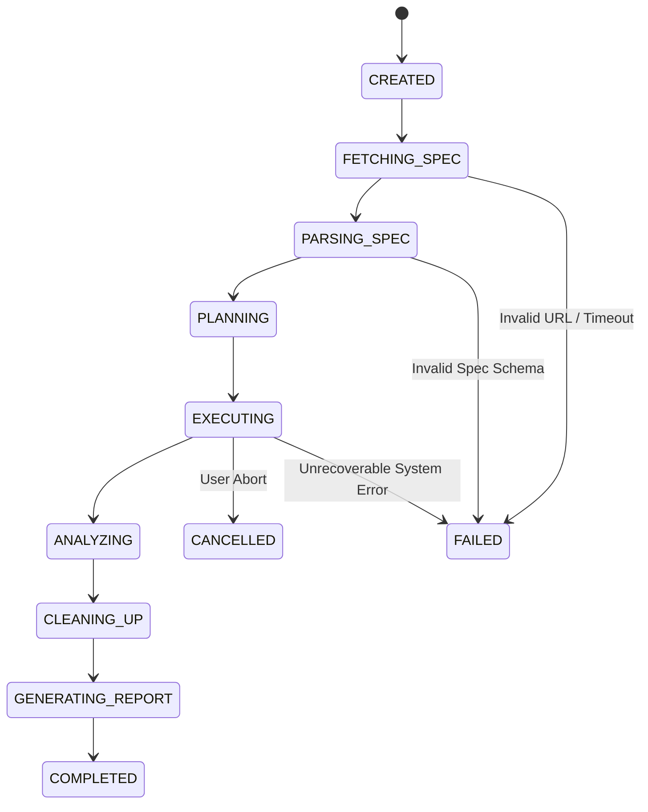

# Architecture Specification — Syed API QA Agent

## 1. System Overview

**Syed API QA Agent** is an autonomous, deterministic API Quality Assurance platform designed specifically for **live, deployed backend services**. 

Unlike development-time IDE linters or mock testers, Syed API QA Agent operates after deployment (e.g., Render, Railway, AWS, Azure, GCP, or client staging/production). Given a live OpenAPI 3.x / Swagger 2.x specification URL, the agent discovers endpoints, extracts schemas, builds dependency graphs, deterministically synthesizes valid payloads, executes multi-step test workflows (including stateful CRUD), isolates failures, tracks performance metrics, cleans up generated resources, and produces an evidence-based HTML/PDF report.

### Core Architectural Principles
1. **Zero LLM Dependency**: The system contains **zero** dependencies on external LLMs (OpenAI, Claude, Gemini, Ollama, etc.), GPUs, or cloud AI tokens. All reasoning, dependency graph modeling, variable inference, data generation, and failure diagnostics use deterministic algorithms, formal schema evaluation, graph theory, state machines, and heuristic rule engines.
2. **Modular Monolith**: Organized as a single deployable service with strictly decoupled domain boundaries to prevent unnecessary distributed systems complexity during V1.
3. **Production Safety First**: Out-of-the-box SSRF defenses, private network/cloud metadata IP blocking, bounded concurrency, request/response payload size limiting, and strict gating on destructive HTTP verbs (`DELETE`, `PUT`, `PATCH`) in production environments.
4. **Resilient Execution & Disconnect Tolerance**: Test runs execute autonomously on the backend. Web clients connect via Server-Sent Events (SSE). If a client disconnects or refreshes, execution continues uninterrupted.

---

## 2. High-Level Topology

```
                              ┌───────────────────────────────────┐
                              │           User / QA Team          │
                              └─────────────────┬─────────────────┘
                                                │ HTTPS / SSE
                                                ▼
                              ┌───────────────────────────────────┐
                              │         Next.js Frontend          │
                              │    (Dashboard, Live SSE, Report)   │
                              └─────────────────┬─────────────────┘
                                                │ REST API / SSE
                                                ▼
┌─────────────────────────────────────────────────────────────────────────────────────────────────┐
│                           Syed API QA Agent — Backend Modular Monolith                         │
│                                                                                                 │
│  ┌───────────────────────┐   ┌────────────────────────┐   ┌──────────────────────────────────┐  │
│  │    Discovery Engine   │   │     Planning Engine    │   │           Run Manager            │  │
│  │  (OpenAPI/Swagger)    │──▶│  (Graph, Step Planner) │──▶│     (Lifecycle, Queue, SSE)      │  │
│  └───────────────────────┘   └────────────────────────┘   └─────────────────┬────────────────┘  │
│                                                                             │                   │
│                                                                             ▼                   │
│  ┌───────────────────────┐   ┌────────────────────────┐   ┌──────────────────────────────────┐  │
│  │  Autonomous Agent     │◀──│      Safety Guard      │◀──│        Test Execution Engine     │  │
│  │  (State Machine &     │   │ (SSRF, Allowlist, Verb │   │  (RestClient, Context Resolution,│  │
│  │   Diagnostic Rules)   │   │  Rate Limits, Redaction│   │   Retry Safety, Timing Capture)  │  │
│  └───────────┬───────────┘   └────────────────────────┘   └─────────────────┬────────────────┘  │
│              │                                                              │                   │
│              ▼                                                              ▼                   │
│  ┌───────────────────────┐   ┌────────────────────────┐   ┌──────────────────────────────────┐  │
│  │   Reporting Engine    │   │   Performance Engine   │   │         Assertion Engine         │  │
│  │ (HTML / PDF Exporters)│◀──│  (Latency P50/95/99)   │◀──│ (Schema, Status, Header, Body)   │  │
│  └───────────────────────┘   └────────────────────────┘   └──────────────────────────────────┘  │
│                                                                                                 │
└────────────────────────────────────────────────┬────────────────────────────────────────────────┘
                                                 │ JPA / SQL
                                                 ▼
                              ┌───────────────────────────────────┐
                              │        PostgreSQL Database        │
                              │ (Runs, Endpoints, Steps, Evidence)│
                              └───────────────────────────────────┘
```

---

## 3. Backend Modules & Domain Boundaries

The backend application is structured into clearly isolated packages with unidirectional dependencies:

| Module / Package | Primary Responsibilities |
| :--- | :--- |
| `com.syed.apiqa.api` | REST Controllers exposing endpoints for Projects, TestRuns, Results, Reports, and SSE feeds. |
| `com.syed.apiqa.security` | Authentication, API security, CORS policies, role-based access. |
| `com.syed.apiqa.safety` | SSRF defense, IP address resolution validation, host allowlists, destructive verb gate, credential masking. |
| `com.syed.apiqa.discovery` | Fetching remote OpenAPI/Swagger specifications, validation, schema extraction, endpoint cataloging. |
| `com.syed.apiqa.planning` | Dependency graph construction, cycle detection, CRUD sequence formulation, topological step ordering. |
| `com.syed.apiqa.generation` | Deterministic, schema-compliant test data synthesis with reproducible seeds (no LLM). |
| `com.syed.apiqa.execution` | HTTP client dispatch (Spring `RestClient`), variable substitution `{{var}}`, timing, response capture, non-retry safety for POST. |
| `com.syed.apiqa.assertion` | Declarative assertion evaluation: HTTP status codes, JSON Schema compliance, mandatory field existence, type conformity. |
| `com.syed.apiqa.performance` | Latency recording, percentile calculation (P50, P90, P95, P99), outlier detection, concurrency benchmarking. |
| `com.syed.apiqa.analysis` | Rule-based failure classification (e.g. 401 Auth, 404 Missing Resource/Dependency, 409 Conflict, 422 Contract Drift). |
| `com.syed.apiqa.agent` | Autonomous step-by-step orchestrator: Observe -> Understand -> Plan -> Execute -> Observe -> Analyze -> Next Action. |
| `com.syed.apiqa.run` | Asynchronous test execution management, thread pool control, run state transitions, SSE subscriber broadcasting. |
| `com.syed.apiqa.reporting` | Evidence compilation, secret-sanitized HTML report generation, and PDF document rendering. |
| `com.syed.apiqa.persistence` | JPA entity declarations, Spring Data repositories, Flyway migration scripts. |

---

## 4. Test Run Lifecycle

A `TestRun` traverses the following deterministic state transitions:



1. **CREATED**: The user registers a run with a target OpenAPI URL, environment (Staging/Production), auth credentials, and safety settings.
2. **FETCHING_SPEC**: The URL is validated against the SSRF guard and retrieved.
3. **PARSING_SPEC**: OpenAPI 3.x or Swagger 2 spec is parsed, validated, and normalized into internal domain catalog (`ApiEndpoint`).
4. **PLANNING**: The Dependency Engine builds an operation dependency graph, resolves required path parameters, infers relationships, and produces an ordered list of `TestCase` and `TestStep` records.
5. **EXECUTING**: The execution engine processes steps sequentially or with bounded concurrency, applying variable extraction and propagation.
6. **ANALYZING**: The rule engine reviews all step outputs, categorizing errors and calculating pass/fail statistics.
7. **CLEANING_UP**: Resources tracked during creation (e.g., created user IDs, created orders) are deleted in reverse topological order if destructive cleanup is enabled.
8. **GENERATING_REPORT**: Evidence is sanitized of all secrets and compiled into an HTML report and persistent metrics.
9. **COMPLETED**: Final status set; SSE stream closes.
